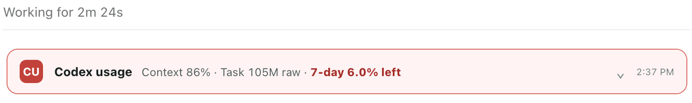
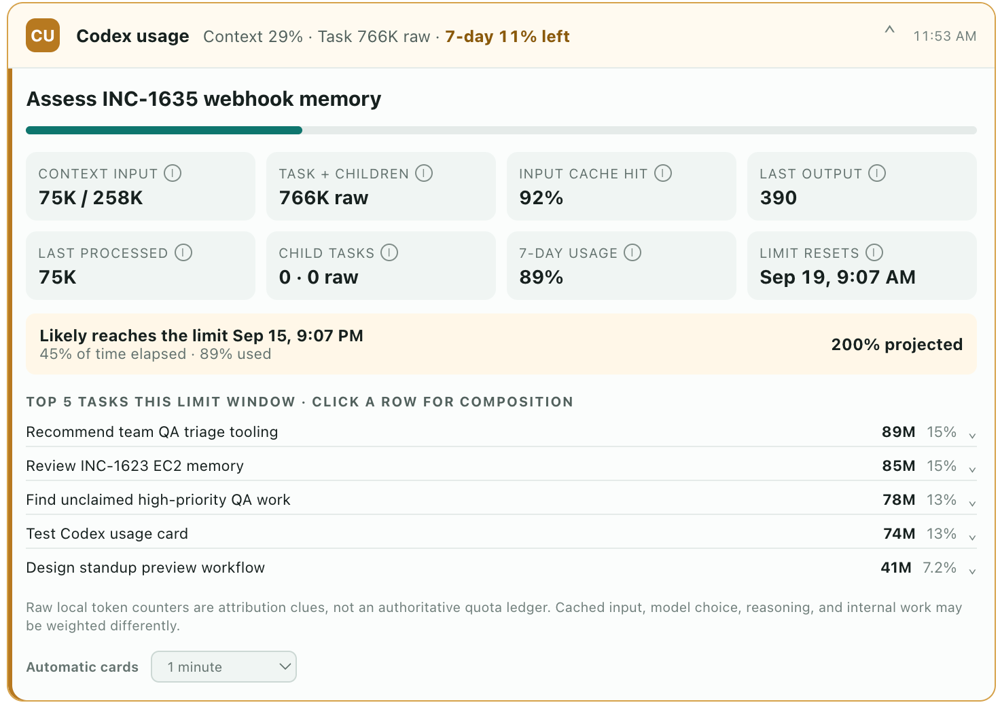

# Codex Usage

A local-first Codex plugin that attributes raw processed tokens to conversations, subagents, automations, and internal activity. It reads local Codex metadata and never uploads it. It supports personal installs, workspace distribution, and self-contained GitHub release bundles without public marketplace publication.

Collapsed warning state:



Expanded details:



## Install

This repository is also a small Git marketplace, so installation does not require publication or OpenAI marketplace review. It is public, so anyone can install it directly.

```bash
codex plugin marketplace add git@github.com:thnk2wn/codex-usage.git --ref main
codex plugin add codex-usage@thnk2wn
```

Start a new Codex task after installation so the skill and tools are loaded. The commands above use SSH, so they need working SSH credentials; swap in the HTTPS URL if you would rather not use SSH.

Automatic cards require a one-time trust review for the bundled `UserPromptSubmit` and `PostToolUse` hooks. Codex Desktop may not surface a pending review, so complete it in Terminal:

1. Run `codex`.
2. Choose **Review hooks** in the startup warning, or enter `/hooks` after Codex opens.
3. Open **UserPromptSubmit** and **PostToolUse** in turn. Verify each source is **Plugin - codex-usage@...** and its command is `python3 "$PLUGIN_ROOT/hooks/auto_usage_card.py"`.
4. Press `t` to trust each hook, then exit the CLI and start a new desktop task.

Trust is saved globally for that exact hook definition. If a later plugin update changes the hook, Codex will require another review.

To pick up a newer version later:

```bash
codex plugin marketplace upgrade thnk2wn
codex plugin add codex-usage@thnk2wn
```

## Share with a team

Without workspace-admin access, sharing is per user rather than an organization-wide deployment. Send teammates the two installation commands above, or have them use the GitHub release bundle below. Distribution stays under GitHub, with no marketplace listing or external approval workflow.

Each teammate must install the plugin themselves. Their workspace must also permit personal or local plugins. If workspace policy disables those installations, there is no supported admin-free bypass; a workspace admin must allow the plugin or import it for the workspace.

## Install across a workspace

A ChatGPT workspace admin is required to distribute this plugin automatically across a workspace. The admin can import it directly from the GitHub repository:

1. Make sure the GitHub account used for the import has any required organization approval.
2. In ChatGPT, open **Admin → Plugins**, then choose **Add → Import marketplace**.
3. Use `https://github.com/thnk2wn/codex-usage` as the source. Leave **Path** empty. Use `main` for automatic updates, or a release tag such as `v0.2.0` for a pinned rollout.
4. Review the imported plugin and set its installation policy to **Installed** for the roles that should receive it. Use **Available** instead if members should opt in.
5. Use **Sync now** when you want to pull an update immediately; otherwise GitHub marketplaces sync daily.

The repository includes both native Codex and Claude-compatible marketplace manifests. Because Codex Usage includes a local MCP server, workspace imports are marked desktop-only; the compact text fallback remains available when a client does not render the inline app.

See [OpenAI's plugin management guide](https://learn.chatgpt.com/docs/enterprise/plugin-management) for current workspace import and access controls.

## Install from a GitHub release

Each release includes a self-contained `codex-usage-vX.Y.Z.zip` marketplace bundle. Download it from [GitHub Releases](https://github.com/thnk2wn/codex-usage/releases), extract it, and run:

```bash
bash ./codex-usage-vX.Y.Z/install.sh
```

The release bundle installs entirely from the extracted files. Keep that directory if you want Codex to retain the local marketplace source. A workspace-admin import is more convenient for a broad managed rollout.

## Public marketplace

This build is intentionally not submitted to OpenAI's universal Plugins Directory. Public submission requires a verified publisher, production listing and policy materials, reproducible test cases, automated scanning, and OpenAI review. MCP-backed submissions normally also require a stable public HTTPS server.

Codex Usage instead runs its MCP server locally because its core purpose is reading local Codex metadata without uploading it. Publishing it universally would therefore require either explicit OpenAI support for a local MCP design or a privacy-sensitive architectural change. The Git marketplace above keeps the current local-only behavior intact.

See [OpenAI's plugin submission documentation](https://developers.openai.com/plugins/deploy/submission) for the current public review requirements.

## UI surfaces

- Automatic cards have a minimum 15-minute gap per task by default. A qualifying user prompt or a tool completion during a long turn requests a **new** compact card after that gap; no timer posts cards into an idle task. Each card's usage values stay fixed.
- The minimized header shows when the card was created and the remaining account capacity. It turns amber when 15% or less remains or current pace projects over the limit, and red when 10% or less remains. Expanding a card fetches its top-five task breakdown once and shows when those details loaded. The initial task metrics remain fixed at creation time. The setting is labeled **New cards (minimum gap)** and offers every turn, 30 seconds, 1/5/15 minutes, or off. Open card instances synchronize that preference when the client permits it, and every historical card rechecks it when expanded.
- `show_usage_card` can also render a card on demand. `refresh_usage_card` only recovers a compact header when component metadata is unavailable or loads the full body on first expansion; it does not run on a timer.
- Mobile Remote falls back to a short multi-line status result when it does not render the MCP App iframe; say `usage details` for a text breakdown. That path uses `usage_details`, which returns the same report as model-readable data, because a card's own render payload is delivered to the component only.
- `open_usage_dashboard` starts the optional private localhost dashboard for a larger cross-task view.
- The old text-only `current_conversation_usage` tool is retained for compatibility but hidden from the model so automatic card requests cannot be routed into raw JSON. Ask for a usage card to see a concise header with expandable details.
- `usage_dashboard` returns structured cross-task data for the current limit window, today, or rolling 7/30-day ranges.

## How automatic cards work

The trusted prompt and tool-completion hooks only decide whether a card is due and ask Codex to invoke it; they do not scan usage data themselves. The first tool result reads the current task and latest account-limit snapshot, so the compact header can appear quickly with context, task tokens, remaining capacity, warning color, and snapshot time. The tool-completion hook runs in the background, so it does not delay the tool that just finished. If a long operation has no tool completion, the next card waits until a tool completes or you send another prompt.

The card does not scan the limit-window task list while collapsed. On first expansion it requests the heavier breakdown once; a brief **Loading cross-task breakdown…** message may appear. That scan is cached for five minutes across requests. Collapsing and expanding the same card again does not fetch it again. The footer distinguishes the card's creation time from the later details-load time.

If a host omits a new card's component metadata, the card uses its tool input to fetch compact values when it first renders, then keeps them fixed. An older card whose original snapshot cannot be recovered shows an error rather than presenting newer values as its original snapshot.

The 15-minute setting is a minimum gap between new conversation items, not a promise that one will appear exactly every 15 minutes. Change it from any expanded card. The preference is shared globally, while the last-requested timestamp is tracked per task. **Every turn** creates at most one automatic card at prompt submission; tool completions do not add more in that mode.

## What the plugin itself costs

Cards are MCP tool results, so they occupy conversation context and are not free. Each automatic card contains the hook instruction and a short text summary. The render data stays in component-only metadata. Clients without MCP App rendering show the text in short lines without a second JSON result.

The card's own render data does not enter the conversation at all. It travels in the tool result's `_meta`, which the host delivers only to the component, so the transcript carries just the text summary. A larger body does not increase the model-visible result.

The hook message carries the tool name, the arguments, and a one-line reminder not to narrate the call, which stays in-turn because the skill alone is a weaker guarantee against the model announcing the card. Everything else it used to spell out on every turn now lives in the skill, which loads once per session. What remains is close to the floor: the arguments alone are about 20 tokens, most of that the thread ID.

The cross-task breakdown is fetched once on first expansion through `refresh_usage_card`, which fills the body without adding a conversation item, so the top-task list never costs context either.

The larger cost is not the card itself but how long it lives. A card stays in conversation history and is re-read on every later turn, so one card early in a 500-turn session is re-read hundreds of times. In one measured week, cards accounted for about 0.65% of raw token usage, and two long sessions produced over 98% of it. Most of those re-reads are cache hits, so the cost against your actual quota is a fraction of the raw number.

After updating a local copy of the plugin, reinstall it before measuring. A stale install keeps returning the older, heavier card.

Practical consequence: **session length matters far more than card frequency.** Lowering the cadence in a short session saves very little. Avoiding automatic cards in very long sessions saves a lot.

To reduce the cost:

- **Zero ongoing cost per task.** Set automatic cards to **off** from any expanded card, then ask for the dashboard and leave the panel open. Opening it returns a tool result like any other tool, so it costs roughly 100 tokens one time. Every refresh after that is served from the browser to the local server every 20 seconds and never enters the model's context, so the ongoing cost really is zero. Note that the dashboard server lives inside the task's local MCP process and stops when that task closes, and it binds a fresh random port each time, so a new task means paying that one-time cost again on a new URL.
- **Lower the cadence.** Moving from every 5 minutes to every 15 minutes cuts card volume roughly threefold. Use this in long sessions especially.
- **Ask on demand.** With automatic cards off, `show_usage_card` still works whenever you want a snapshot.

## Data and privacy

The MCP server reads `~/.codex/state_5.sqlite` and the rollout files already referenced by that database without modifying them. It binds its optional dashboard only to `127.0.0.1`, uses no external network access, and stores no copy of task content. Task names are displayed locally in the card and dashboard. The only plugin writes under `~/.codex/codex-usage/` are the selected automatic-card preference, per-task throttle timestamps, and an empty SQLite lock file that prevents parallel tool completions from claiming duplicate cards.

Cards are still MCP tool-result UI: the plugin's `UserPromptSubmit` hook asks Codex to invoke the card at the start of a qualifying user turn; its `PostToolUse` hook can request another during a long running turn after the interval elapses. It cannot push unsolicited UI into an idle conversation. The hooks store only the per-task last-card time, and preferences live in `~/.codex/codex-usage/`.

Plugin hooks must be reviewed and trusted before Codex will run them. Use the CLI `/hooks` flow described under **Install**; the current desktop app silently skips an unreviewed hook rather than showing the review UI. Until the hook is trusted, cards remain available on demand but will not appear automatically.

The numbers are raw local token counters, not a server-authoritative quota ledger. The aggregate usage percentage is the latest coarse snapshot recorded in local session metadata.

## Development

```bash
/usr/bin/python3 scripts/server.py --self-test
```

After changing a locally installed copy, update its cachebuster and reinstall it from the personal marketplace before testing in a new Codex task.

## License

MIT
